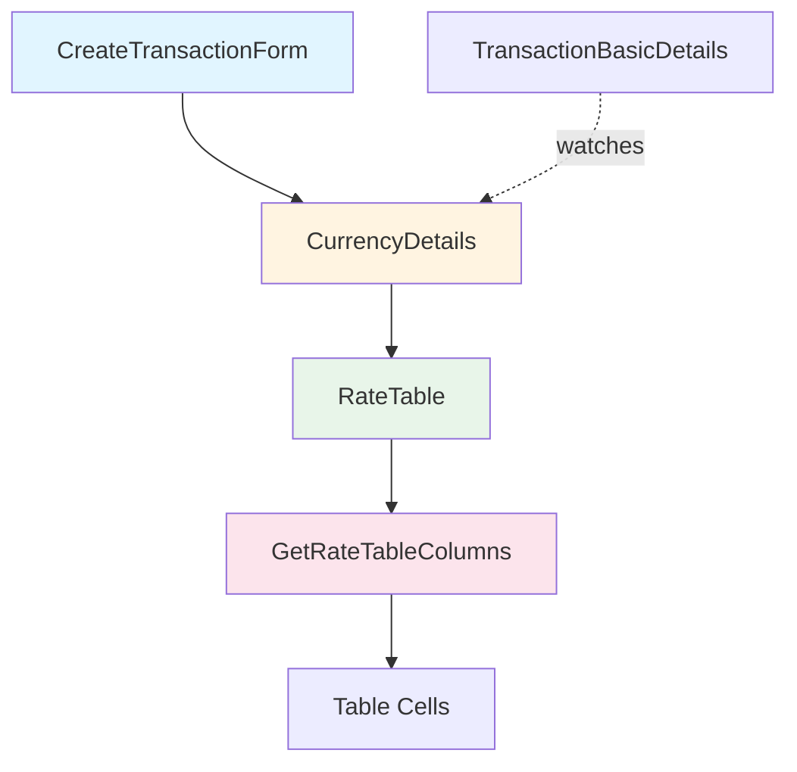
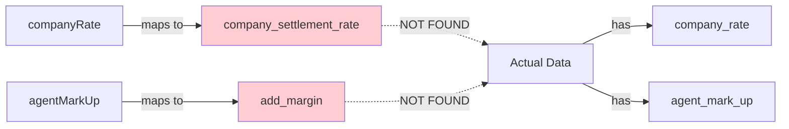
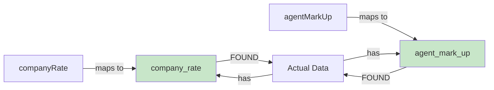
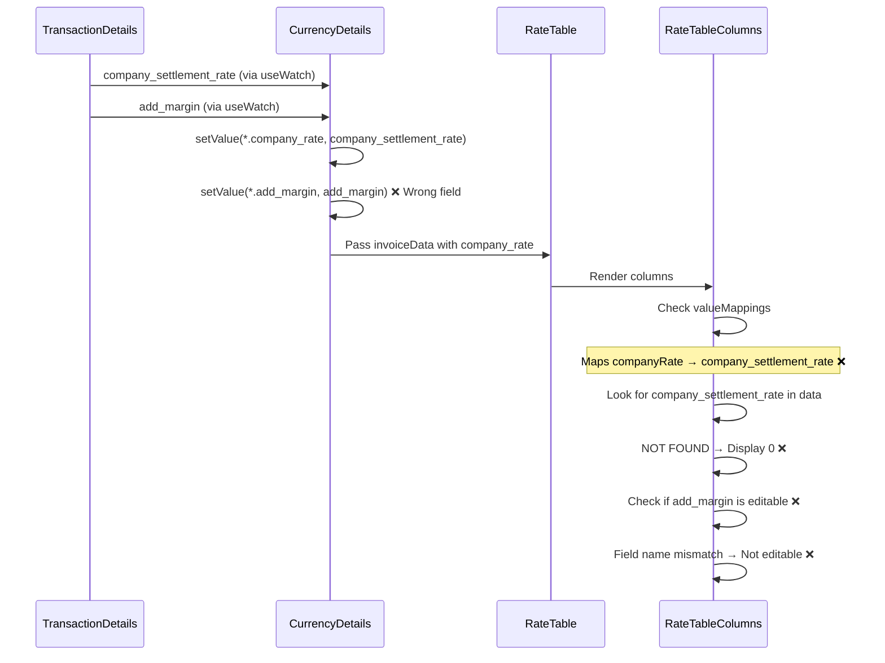
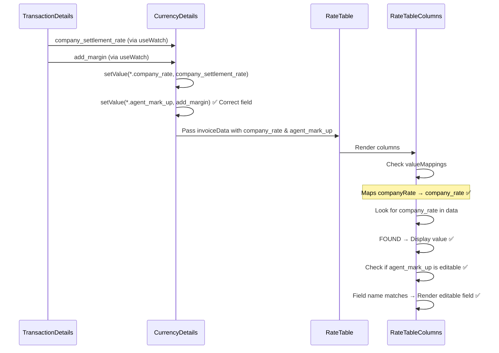
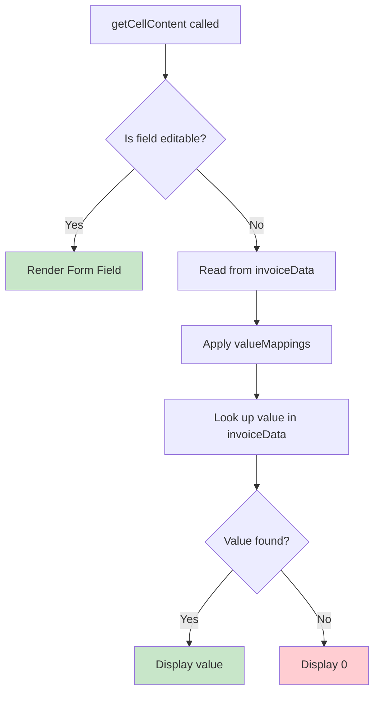

# Rate Table Architecture & Data Flow

## Component Hierarchy



## Current Data Structure

### Form Schema Structure

```typescript
currencyDetails: {
  invoiceRateTable: {
    transaction_value: {
      company_rate: number,      // ← Should display company_settlement_rate
      agent_mark_up: number,     // ← Should be editable, prefilled with add_margin
      rate: number               // ← Calculated: company_rate + agent_mark_up
    },
    remittance_charges: { ... },
    nostro_charges: { ... },
    other_charges: { ... }
  }
}
```

## Problem Analysis

### Issue 1: Field Name Mapping Mismatch

**Current Mapping (INCORRECT):**



**Correct Mapping (SOLUTION):**



### Issue 2: Editable Fields Mismatch

**Current Configuration (INCORRECT):**

```typescript
editableFields={[
  'transactionValue.company_rate',    // ❌ Should be read-only
  'transactionValue.add_margin',      // ❌ Wrong field name
  'remittanceCharges.add_margin',     // ❌ Wrong field name
  'nostroCharges.add_margin',         // ❌ Wrong field name
  'otherCharges.add_margin'           // ❌ Wrong field name
]}
```

**Correct Configuration (SOLUTION):**

```typescript
editableFields={[
  // company_rate removed - should be read-only
  'transactionValue.agent_mark_up',   // ✅ Correct field name
  'remittanceCharges.agent_mark_up',  // ✅ Correct field name
  'nostroCharges.agent_mark_up',      // ✅ Correct field name
  'otherCharges.agent_mark_up'        // ✅ Correct field name
]}
```

## Data Flow Diagram

### Current Flow (With Issues)



### Fixed Flow (Solution)



## Rate Table Display Logic

### getCellContent Function Flow



## Solution Summary

### Changes Required

#### 1. rate-table-columns.tsx

```typescript
// BEFORE (Lines 34-38)
const valueMappings: Record<string, string> = {
  companyRate: 'company_settlement_rate', // ❌
  agentMarkUp: 'add_margin', // ❌
  rate: 'rate',
};

// AFTER
const valueMappings: Record<string, string> = {
  companyRate: 'company_rate', // ✅
  agentMarkUp: 'agent_mark_up', // ✅
  rate: 'rate',
};
```

#### 2. currency-details.tsx

**Change A: editableFields (Line 246)**

```typescript
// BEFORE
editableFields={[
  'transactionValue.company_rate',
  'transactionValue.add_margin',
  'remittanceCharges.add_margin',
  'nostroCharges.add_margin',
  'otherCharges.add_margin'
]}

// AFTER
editableFields={[
  'transactionValue.agent_mark_up',
  'remittanceCharges.agent_mark_up',
  'nostroCharges.agent_mark_up',
  'otherCharges.agent_mark_up'
]}
```

**Change B: useEffect setValue calls (Lines 88-97)**

```typescript
// BEFORE
setValue('currencyDetails.invoiceRateTable.transaction_value.add_margin', addMargin, ...);
setValue('currencyDetails.invoiceRateTable.remittance_charges.add_margin', addMargin, ...);
setValue('currencyDetails.invoiceRateTable.nostro_charges.add_margin', addMargin, ...);
setValue('currencyDetails.invoiceRateTable.other_charges.add_margin', addMargin, ...);

// AFTER
setValue('currencyDetails.invoiceRateTable.transaction_value.agent_mark_up', addMargin, ...);
setValue('currencyDetails.invoiceRateTable.remittance_charges.agent_mark_up', addMargin, ...);
setValue('currencyDetails.invoiceRateTable.nostro_charges.agent_mark_up', addMargin, ...);
setValue('currencyDetails.invoiceRateTable.other_charges.agent_mark_up', addMargin, ...);
```

**Change C: useWatch hooks (Lines 52-59)**

```typescript
// BEFORE
const transactionValueAgentMarkUp = useWatch({ name: 'currencyDetails.invoiceRateTable.transaction_value.add_margin' });
const remittanceAgentMarkUp = useWatch({ name: 'currencyDetails.invoiceRateTable.remittance_charges.add_margin' });
const nostroAgentMarkUp = useWatch({ name: 'currencyDetails.invoiceRateTable.nostro_charges.add_margin' });
const otherAgentMarkUp = useWatch({ name: 'currencyDetails.invoiceRateTable.other_charges.add_margin' });

// AFTER
const transactionValueAgentMarkUp = useWatch({
  name: 'currencyDetails.invoiceRateTable.transaction_value.agent_mark_up',
});
const remittanceAgentMarkUp = useWatch({ name: 'currencyDetails.invoiceRateTable.remittance_charges.agent_mark_up' });
const nostroAgentMarkUp = useWatch({ name: 'currencyDetails.invoiceRateTable.nostro_charges.agent_mark_up' });
const otherAgentMarkUp = useWatch({ name: 'currencyDetails.invoiceRateTable.other_charges.agent_mark_up' });
```

## Expected Result

### Rate Table Display (After Fix)

| Particulars        | Company Settlement Rate | Add Margin          | Amount |
| ------------------ | ----------------------- | ------------------- | ------ |
| Transaction Value  | **85.50** (read-only)   | **2.00** (editable) | 87.50  |
| Remittance Charges | **85.50** (read-only)   | **2.00** (editable) | 87.50  |
| Nostro Charges     | **85.50** (read-only)   | **2.00** (editable) | 87.50  |
| Other Charges      | **85.50** (read-only)   | **2.00** (editable) | 87.50  |

### Behavior

- ✅ **Company Settlement Rate** displays the value from `transactionDetails.company_settlement_rate`
- ✅ **Company Settlement Rate** is read-only (not editable)
- ✅ **Add Margin** is prefilled with value from `transactionDetails.add_margin`
- ✅ **Add Margin** is editable - users can modify it
- ✅ **Amount** is automatically calculated as: `company_rate + agent_mark_up`
- ✅ Changes to **Add Margin** immediately update the **Amount** column

## Testing Scenarios

### Test Case 1: Initial Load

1. Open create transaction form
2. Enter company_settlement_rate = 85.50
3. Enter add_margin = 2.00
4. Navigate to Currency Details tab
5. **Expected:** Rate table shows company_rate = 85.50 (read-only) and agent_mark_up = 2.00 (editable) in all rows

### Test Case 2: Edit agent_mark_up

1. In rate table, modify agent_mark_up for Transaction Value to 3.00
2. **Expected:**
   - Transaction Value rate updates to 88.50 (85.50 + 3.00)
   - Other rows remain at 87.50 (85.50 + 2.00)

### Test Case 3: company_rate Read-Only

1. Try to click on company_rate field
2. **Expected:** Field is not editable, displays as plain text

### Test Case 4: Change company_settlement_rate

1. Go back to Transaction Details
2. Change company_settlement_rate to 86.00
3. Return to Currency Details
4. **Expected:** All company_rate values in rate table update to 86.00
