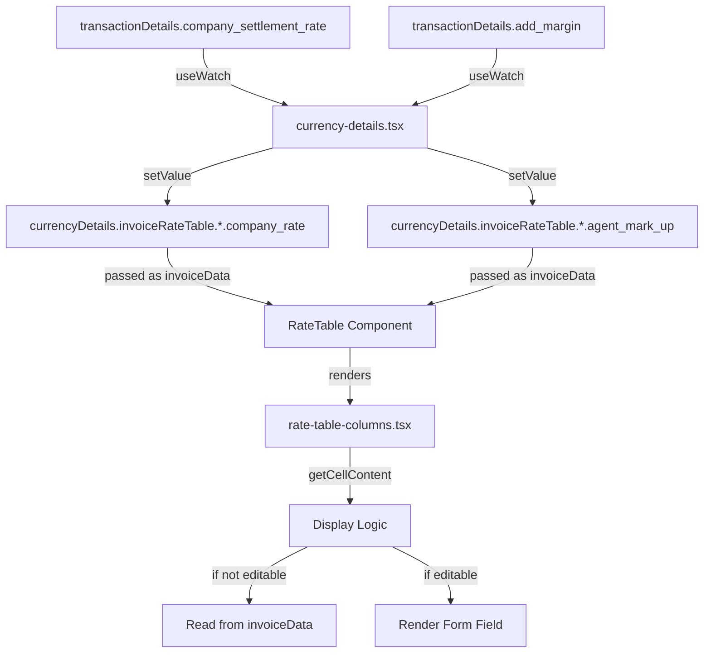

# Rate Table Display and Edit Functionality Fix - Implementation Plan

## Overview
This document outlines the plan to fix two issues in the rate table component:
1. **company_rate** column not displaying values (should show `company_settlement_rate`)
2. **agent_mark_up** fields should be editable and prefilled with `add_margin` value

## Current State Analysis

### Issue 1: company_rate Not Displaying

**Root Cause:**
In [`rate-table-columns.tsx`](src/features/maker/components/rate-table/rate-table-columns.tsx:59-72), the `getCellContent` function has logic that checks if a field is editable. When a field is NOT editable, it tries to read the value from `invoiceData`:

```typescript
const getCellContent = (section: string, columnKey: 'companyRate' | 'agentMarkUp' | 'rate') => {
  // ... mapping logic ...
  if (isEditable) {
    return getFormField(fieldPath);
  } else {
    const dataKey = valueMappings[columnKey] || columnKey;
    const value = invoiceData?.[section]?.[dataKey] ?? 0;
    return <span className="text-right">{value}</span>;
  }
};
```

**Problem:** The `invoiceData` prop passed to the rate table contains the form field names (`company_rate`, `agent_mark_up`, `rate`), but the code is looking for `company_settlement_rate` due to the `valueMappings` object:

```typescript
const valueMappings: Record<string, string> = {
  companyRate: 'company_settlement_rate',  // ❌ This mapping is incorrect
  agentMarkUp: 'add_margin',
  rate: 'rate',
};
```

The actual data structure in `invoiceData` uses `company_rate` (not `company_settlement_rate`), so the lookup fails and returns 0.

### Issue 2: agent_mark_up Not Editable

**Current State:**
In [`currency-details.tsx`](src/features/maker/components/transaction/tabs/create-transactions-tab/create-transaction-form/form/form-sections/currency-details/currency-details.tsx:246), the `editableFields` prop is:

```typescript
editableFields={['transactionValue.company_rate', 'transactionValue.add_margin', 'remittanceCharges.add_margin', 'nostroCharges.add_margin', 'otherCharges.add_margin']}
```

**Problem:** The field names use `add_margin` but the actual form field path uses `agent_mark_up` (based on the schema). There's a mismatch between:
- Form field name: `agent_mark_up` (in schema)
- Editable field name: `add_margin` (in editableFields array)

## Data Flow Analysis

### Current Data Flow



### Issues in Data Flow

1. **Mapping Mismatch**: `valueMappings` in `rate-table-columns.tsx` maps `companyRate` to `company_settlement_rate`, but the actual data has `company_rate`
2. **Field Name Mismatch**: `editableFields` uses `add_margin` but schema uses `agent_mark_up`
3. **Data Not Syncing**: The `company_rate` values are set via `setValue` but not properly displayed

## Solution Design

### Solution 1: Fix company_rate Display

**Approach:** Update the `valueMappings` in [`rate-table-columns.tsx`](src/features/maker/components/rate-table/rate-table-columns.tsx:34-38) to correctly map to the actual field names in the form data.

**Changes Required:**

1. **File:** `src/features/maker/components/rate-table/rate-table-columns.tsx`
   - **Line 34-38:** Update `valueMappings` object
   ```typescript
   const valueMappings: Record<string, string> = {
     companyRate: 'company_rate',      // ✅ Changed from 'company_settlement_rate'
     agentMarkUp: 'agent_mark_up',     // ✅ Changed from 'add_margin'
     rate: 'rate',
   };
   ```

**Rationale:** The form data structure uses `company_rate` and `agent_mark_up` as field names (as defined in the schema), so the mappings should match these exact names.

### Solution 2: Make agent_mark_up Editable

**Approach:** Update the `editableFields` array in [`currency-details.tsx`](src/features/maker/components/transaction/tabs/create-transactions-tab/create-transaction-form/form/form-sections/currency-details/currency-details.tsx:246) to use the correct field names that match the form schema.

**Changes Required:**

1. **File:** `src/features/maker/components/transaction/tabs/create-transactions-tab/create-transaction-form/form/form-sections/currency-details/currency-details.tsx`
   - **Line 246:** Update `editableFields` array
   ```typescript
   editableFields={[
     'transactionValue.agent_mark_up',      // ✅ Changed from 'add_margin'
     'remittanceCharges.agent_mark_up',     // ✅ Changed from 'add_margin'
     'nostroCharges.agent_mark_up',         // ✅ Changed from 'add_margin'
     'otherCharges.agent_mark_up'           // ✅ Changed from 'add_margin'
   ]}
   ```

**Note:** Remove `transactionValue.company_rate` from editableFields since it should be read-only.

**Rationale:** The schema defines the field as `agent_mark_up`, and the form field paths use this name. The editableFields array must match these exact paths for the edit logic to work correctly.

### Solution 3: Ensure Proper Data Synchronization

**Current State:** The [`currency-details.tsx`](src/features/maker/components/transaction/tabs/create-transactions-tab/create-transaction-form/form/form-sections/currency-details/currency-details.tsx:88-97) already has a `useEffect` that syncs `add_margin` to all `agent_mark_up` fields:

```typescript
useEffect(() => {
  if (addMargin && !isNaN(Number(addMargin))) {
    setValue('currencyDetails.add_margin', addMargin, { shouldValidate: false, shouldDirty: false });
    // Set add_margin fields
    setValue('currencyDetails.invoiceRateTable.transaction_value.add_margin', addMargin, { shouldValidate: false, shouldDirty: false });
    setValue('currencyDetails.invoiceRateTable.remittance_charges.add_margin', addMargin, { shouldValidate: false, shouldDirty: false });
    setValue('currencyDetails.invoiceRateTable.nostro_charges.add_margin', addMargin, { shouldValidate: false, shouldDirty: false });
    setValue('currencyDetails.invoiceRateTable.other_charges.add_margin', addMargin, { shouldValidate: false, shouldDirty: false });
  }
}, [addMargin, setValue]);
```

**Problem:** The code sets `add_margin` but the schema field is `agent_mark_up`.

**Changes Required:**

1. **File:** `src/features/maker/components/transaction/tabs/create-transactions-tab/create-transaction-form/form/form-sections/currency-details/currency-details.tsx`
   - **Line 88-97:** Update field names in setValue calls
   ```typescript
   useEffect(() => {
     if (addMargin && !isNaN(Number(addMargin))) {
       setValue('currencyDetails.add_margin', addMargin, { shouldValidate: false, shouldDirty: false });
       // Set agent_mark_up fields (corrected field names)
       setValue('currencyDetails.invoiceRateTable.transaction_value.agent_mark_up', addMargin, { shouldValidate: false, shouldDirty: false });
       setValue('currencyDetails.invoiceRateTable.remittance_charges.agent_mark_up', addMargin, { shouldValidate: false, shouldDirty: false });
       setValue('currencyDetails.invoiceRateTable.nostro_charges.agent_mark_up', addMargin, { shouldValidate: false, shouldDirty: false });
       setValue('currencyDetails.invoiceRateTable.other_charges.agent_mark_up', addMargin, { shouldValidate: false, shouldDirty: false });
     }
   }, [addMargin, setValue]);
   ```

2. **Line 52-59:** Update useWatch field names
   ```typescript
   const transactionValueAgentMarkUp = useWatch({ name: 'currencyDetails.invoiceRateTable.transaction_value.agent_mark_up' });
   const remittanceAgentMarkUp = useWatch({ name: 'currencyDetails.invoiceRateTable.remittance_charges.agent_mark_up' });
   const nostroAgentMarkUp = useWatch({ name: 'currencyDetails.invoiceRateTable.nostro_charges.agent_mark_up' });
   const otherAgentMarkUp = useWatch({ name: 'currencyDetails.invoiceRateTable.other_charges.agent_mark_up' });
   ```

## Implementation Steps

### Step 1: Update rate-table-columns.tsx
- [ ] Fix `valueMappings` object to use correct field names
- [ ] Verify the `getCellContent` function properly reads from invoiceData

### Step 2: Update currency-details.tsx
- [ ] Update `editableFields` array to use `agent_mark_up` instead of `add_margin`
- [ ] Remove `transactionValue.company_rate` from editableFields
- [ ] Update `useEffect` that syncs add_margin to use correct field names
- [ ] Update `useWatch` hooks to watch correct field names

### Step 3: Verify Data Flow
- [ ] Ensure `company_settlement_rate` from transactionDetails syncs to `company_rate` in invoiceRateTable
- [ ] Ensure `add_margin` from transactionDetails syncs to `agent_mark_up` in invoiceRateTable
- [ ] Verify rate calculation: `rate = company_rate + agent_mark_up`

### Step 4: Testing
- [ ] Test that company_rate displays correctly in all rows
- [ ] Test that agent_mark_up fields are editable
- [ ] Test that agent_mark_up is prefilled with add_margin value
- [ ] Test that modifying agent_mark_up updates the rate calculation
- [ ] Test that company_rate remains read-only

## Files to Modify

1. **[`src/features/maker/components/rate-table/rate-table-columns.tsx`](src/features/maker/components/rate-table/rate-table-columns.tsx)**
   - Update `valueMappings` object (lines 34-38)

2. **[`src/features/maker/components/transaction/tabs/create-transactions-tab/create-transaction-form/form/form-sections/currency-details/currency-details.tsx`](src/features/maker/components/transaction/tabs/create-transactions-tab/create-transaction-form/form/form-sections/currency-details/currency-details.tsx)**
   - Update `editableFields` array (line 246)
   - Update `useEffect` for syncing add_margin (lines 88-97)
   - Update `useWatch` hooks (lines 52-59)

## Expected Behavior After Fix

### Requirement 1: company_rate Display
- ✅ company_rate column displays the value from `company_settlement_rate`
- ✅ company_rate is read-only (not editable)
- ✅ All rows (transaction_value, remittance_charges, nostro_charges, other_charges) show the same company_rate value

### Requirement 2: agent_mark_up Editable
- ✅ agent_mark_up fields are editable in all rows
- ✅ agent_mark_up is prefilled with the `add_margin` value from transactionDetails
- ✅ Users can modify agent_mark_up independently for each row
- ✅ Modifying agent_mark_up updates the rate calculation: `rate = company_rate + agent_mark_up`

## Risk Assessment

### Low Risk
- Changes are localized to specific components
- No database schema changes required
- No API changes required

### Potential Issues
1. **Field Name Consistency**: Ensure all references use consistent field names throughout the codebase
2. **Form Validation**: Verify that validation still works correctly after field name changes
3. **Data Submission**: Ensure the form submission in [`create-transaction-form.tsx`](src/features/maker/components/transaction/tabs/create-transactions-tab/create-transaction-form/form/create-transaction-form.tsx:60-72) correctly maps the field names

## Validation Checklist

After implementation, verify:
- [ ] company_rate displays correctly in rate table
- [ ] company_rate is read-only
- [ ] agent_mark_up fields are editable
- [ ] agent_mark_up is prefilled with add_margin
- [ ] Rate calculation works: rate = company_rate + agent_mark_up
- [ ] Form validation still works
- [ ] Form submission sends correct data structure
- [ ] No console errors or warnings

## Notes

### Field Naming Convention
The codebase has inconsistent naming:
- **API/Backend**: Uses snake_case (`company_settlement_rate`, `add_margin`)
- **Form Schema**: Uses snake_case (`company_rate`, `agent_mark_up`)
- **Display Labels**: Uses camelCase in mappings (`companyRate`, `agentMarkUp`)

This plan maintains the existing schema field names and fixes the mapping inconsistencies.

### Future Improvements
Consider standardizing field naming conventions across the entire application to prevent similar issues in the future.
